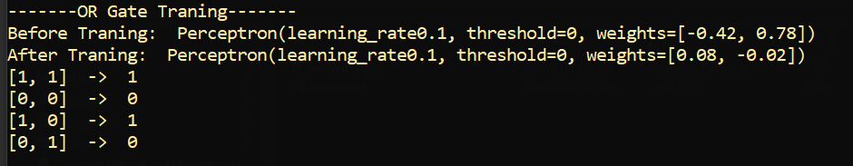
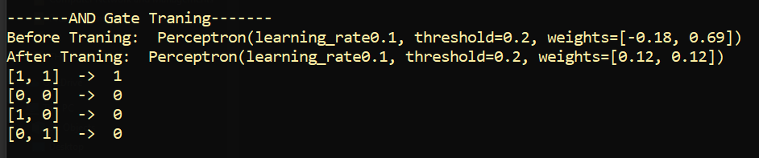
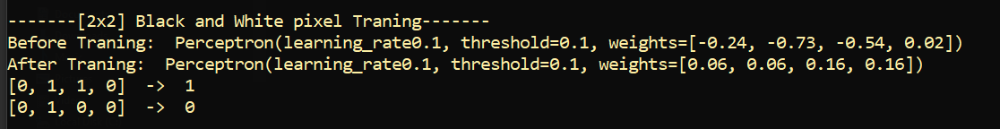

## Simple Perceptron Example
## OR Gate Traning
### Description:
> Single perceptron is trained to behave like a OR Gate

---
## AND Gate Traning
### Description:
> Single perceptron is trained to behave like a AND Gate

---
## 2x2 Black And White Pixel Traning
### Description:
> Single perceptron is trained to behave like a Pixel Classifier

## Rules
2 or 3 or 4 white pixels: output -> White

0 or 1 white pixels: output -> Black  

## Terminologies:
0 -> Black

1 -> White

