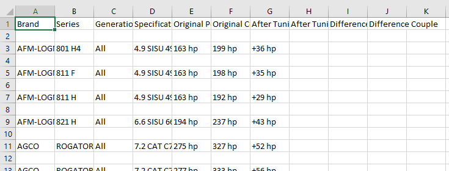

# ecufiles.com Scrapper
## __requests_html__ library is used to scrap the full website.

### To install this library at your system use the following command.

> pip install requests-html

## What the Script will do?

This script will scrap full website data and save that data into the csv file.

Following are the Attribute which the script will scrap.

| Brand | Series | Generation  | Specification | Original Power |Original Couple | After Tuning Power | After Tuning Couple  | Difference Power | Difference Couple |
| ----- |:------:|-------------|---------------|--------------- | ----- |:------:|-------------|---------------|--------------- |

# How can I use this script

All you need to is to have latest version of python [3.6] or above and you should have the required library instlled as mentioned above.

After all the thing setuped you just have to run the sript. you can run the script either form command line or by double clicking it.

# Time Required to complete the srcipt

The time compelxity of this script is O(n^5), because it involves five loops that will work iteratively on one another.

> ### The total time will be approximated 12hours to scrap the full data.

# For Developers

You can modify the script as you may like. I have designed this for full scrap, you can modify to scrap just two to three pages by changin the code. all other stuff will be same.

> Note: chaning the one pipeline will effect the woking of the next pipeline.

## How the Script will Work?

The script work using five data pipelines.

* brand pipeline
* series pipeline
* build pipeline
* specification pipeline
* table pipeline

---

## Brand pipeline:
This pipeline is responsible for selection of brand from the brand select list and also responsible for downloading the required page.

This pipeline will next pass the data to the series pipeline for further processing.

---

## Series Pipeline:
This pipeline is responsible for downloading the series selection page and also responsible for selecting series with respect to each brand name.

One brand name can have multiple series names so the script will operate on each level of the series.

Further this pipeline will pass the data to its next Build Pipeline.

---

## Build Pipeline:

This pipeline will download the next html and responsible for the selection of the Generation related to each series.

Each brand-series can have different gereration. This pipeline will loop through each gerneation and pass the data to the next pipeline.

---

## Specification Pipeline:

This pipeline will download the specification selection page and responsible for selection of specification from the specification list. 

This will loop through each specification configuration and pass the data to the next pipeline for final processing.

---

## Table Pipeline:

The final pipeline is the table pipeline. This pipeline is responsible for downloading the web page and scrap the real data present in the table. This pipeline will also add the scraped data in the pre defined format related to the particular table data.

