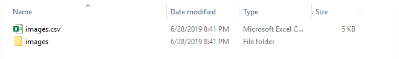

# Non Blocked-Websites Directory Downloader | Crawler

## Technology Used:
* Python 3.6 or latest version
* __request-html__ python library for HTTPS/HTTP web request
* __csv__ python _built-in_ module for saving the downloaded file history


## What the Script will do ?
> This script will download all the files present the directory you are interested in and save where you have run the script.

## Where the script will work ?
> Works where directory access is un-intentially allowed or not-blocked.

The script will work where the directory access of website is unintentially allowed by the apache server or mistakely by the admin of the server or site.

---
## How to use the Scirpt ?
To use the script you need python installed at your Computer and requtest-HTML both.

* ## Download Python.
To Download python in your machine use follow the following link

### [Click Here To Download Python](https://www.python.org/downloads/ "Python Official Page")

* ## To Install request write the following command in Terminal | cmd
```bat
pip install requests-HTML
```
After all that stuff you open the file in any text editor(notepad/notepad++) and paste your URL, where site_url is written with in a single quote.

> Note: Make sure you have already set python environment variables while intalling

---
## How the Script will work ?
The script will request the server for the required web-page where the link of the directory files are available.

Following image shows the Index page how it will looks like in browser and __the script will work only if the page looks like this.__ other wise some modification will be required. 


After The script will run you will see the folder and .csv file like this and all the files will be present in that folder.



The scraped data will be look like this.

Engineers View:


Pretty View:


---
## Why request-html why not Beautiful-Soup?
I have used request-html for web scrapping because it is more robust, and provide more features than Beautiful Soup and build over the Beautiful Soup lib itself so, it will cover the beautiful soup as well.

