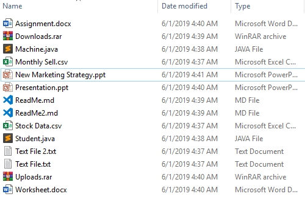
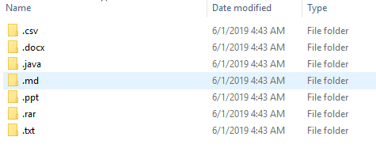

# File Organizer | Auto File Organization using python

### Pre-requesits
* python [3.6] or above

## What the Script will do?
The script will organize the files and move the files to their respected folders/directories based on their __file type__.

### Libraires Used:
* os module
* shutil module
* sys module

## How to use the Script?
You should have the script(download it) and you should have downloaded and installed the pre-requesits as mentioned above.

### Use the script as follows:

#### Open the terminal or command prompt and enter the following command.
> ## python organize.py [source_path] [destination_path]

### The script will accept two [2] optional command line arguments.

[ ]  square brackets represents optional arguments.

* If __no__ command line arguments are given than the script will take source and destination the same directory where it is being run. and organize the files at the same directory.

* If [source_path] argument is given only than the destination will be selected the same. And organize the files in the same source directory.

* If both the arguments are given than the script will take the files form source path and moves the file to the destination path in the specific order.

## How the script will work?

The Script will check for every item present in the directory, it will first check weather the item is file or director if the item is file than it will check for its file type by checking its extension name and do check weather the directory with that extension name is present in the destination path or not. If the directory is not found than it will create the directory with that name and proceed further.

Now all the things are setuped, its time to move the files around their specified directories. 

> Note: The script will work in iteratively maner.

# Screen shots!

## File Structure Before Organization:

---

## Files Structure After Organization:

### Files having same type will group together

